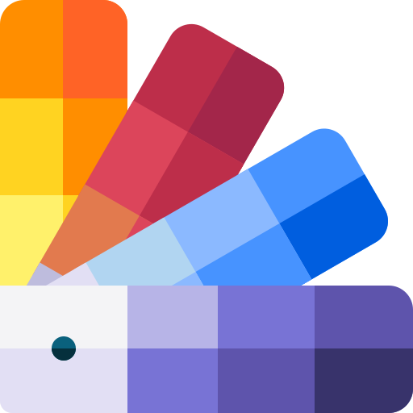

<p align="center">
  
</p>

<h1 align="center">WorldTools</h1>

<p align="center">
  <strong>Premium All-in-One Desktop & Web Toolkit</strong><br>
  <em>20+ essential tools for creators, developers, and power users.</em>
</p>

<p align="center">
  
  
  
  
</p>

---

## ✨ Features

### 🎨 Design & Media
| Tool | Description |
|---|---|
| **Image Studio Pro** | Full canvas editor with vector shapes, layers, text, brushes, and AI-powered image generation & editing |
| **AI Background Remover** | Remove image backgrounds offline using on-device AI (ONNX Runtime) |
| **Convert Things** | Universal converter for images, audio, and video formats |
| **Media Trimmer & Joiner** | Cut and merge audio/video files with waveform editor |
| **YouTube Downloader** | Download YouTube videos and audio in high quality |
| **Color Picker & Palette** | Pick colors, generate palettes and CSS gradients |

### 🤖 AI Smart Tools
| Tool | Description |
|---|---|
| **AI Content Detector** | Analyze text to detect AI-generated content |
| **Prompt Helper** | Transform simple ideas into optimized AI prompts |

### 🛠️ Developer Tools
| Tool | Description |
|---|---|
| **JSON Formatter & Validator** | Format, minify, and validate JSON with syntax highlighting |
| **Base64 Encoder/Decoder** | Encode and decode Base64 strings |
| **Hash & Crypto Generator** | MD5, SHA, Bcrypt, HMAC and file checksums |
| **URL Encoder/Decoder** | Encode and decode URLs |
| **Serial Terminal** | Professional serial port monitor for hardware debugging |

### 🧪 Test Devices
| Tool | Description |
|---|---|
| **Screen Test** | Dead pixel and screen bleeding detection |
| **Audio & Stereo Test** | Speaker channel and frequency testing |
| **Keyboard Tester** | Key verification and KeyCode display |
| **Mouse & Scroll Tester** | Button, double-click, and scroll testing |
| **Device Info** | Browser, OS, hardware, and network details |

### ✏️ Text & Content
| Tool | Description |
|---|---|
| **Text & Word Counter** | Real-time character, word, and line counting |
| **Lorem Ipsum Generator** | Placeholder text generation |

### 🎲 Utilities
| Tool | Description |
|---|---|
| **Smart Calculator** | Professional calculator with expression history |
| **Stopwatch & Timer** | Lap tracking stopwatch |
| **Randomness Hub** | Wheels, random numbers, passwords, UUIDs |
| **QR Code Generator** | QR codes from any text or URL |

---

## 🖥️ Tech Stack

- **Frontend**: Vanilla JS + Vite
- **Backend**: Express.js (local API server)
- **Desktop**: Electron 41
- **AI Providers**: Pollinations AI, Magnific, Google Gemini, Puter AI
- **Image Processing**: ONNX Runtime (client-side background removal)
- **Media**: FFmpeg, yt-dlp (bundled for desktop)
- **Web Deployment**: Vercel (serverless functions)

---

## 🚀 Getting Started

### Prerequisites
- [Node.js](https://nodejs.org/) v18+
- npm v9+

### Installation

```bash
git clone https://github.com/Monkez/worldtools.git
cd worldtools
npm install
```

### Development

```bash
# Start Vite dev server (frontend only)
npm run dev

# Start Electron app (full desktop experience)
npm run electron
```

### Build

```bash
# Build production frontend
npm run build

# Package desktop app (Windows installer)
npm run package
```

The installer will be generated at `release/WorldTools Setup x.x.x.exe`.

---

## 🌐 Web Deployment (Vercel)

WorldTools can be deployed as a web application on [Vercel](https://vercel.com):

1. Import the GitHub repo on Vercel
2. Framework: **Vite** (auto-detected)
3. Add environment variables:
   - `GEMINI_API_KEY` — for AI Smart Tools
4. Deploy!

> **Note:** Some features require desktop access and won't work on the web version:
> Serial Terminal, YouTube Downloader, Media conversion (FFmpeg), native Color Picker.

---

## ⚙️ Configuration

### AI Providers

Configure AI providers in **Global Settings** (gear icon in sidebar):

| Provider | Use Case | Key Required |
|---|---|---|
| Google Gemini | AI chat, prompt refinement, vision | API Key |
| Pollinations AI | Image generation & editing | Optional API Key |
| Magnific | Image generation & editing | API Key |
| Puter AI | AI chat (free tier) | No key needed |
| Custom (OpenAI-compatible) | Any local/remote LLM | Depends |

API keys are stored locally in `localStorage` and never sent to third parties.

---

## 📁 Project Structure

```
worldtools/
├── api/                  # Vercel serverless functions
│   └── ai/              
├── public/               # Static assets
├── server/               # Express backend
│   ├── index.js          # API routes
│   └── providers/        # AI provider modules
│       ├── pollinations.js
│       └── magnific.js
├── src/
│   ├── main.js           # App entry & routing
│   ├── style.css         # Global styles
│   ├── tools/            # Tool modules
│   │   ├── imageStudio.js
│   │   ├── colorPicker.js
│   │   ├── calculator.js
│   │   └── ...
│   └── utils/            # Shared utilities
│       ├── aiClient.js
│       └── apiBase.js
├── main.cjs              # Electron main process
├── index.html            # SPA entry
├── vite.config.js        # Vite configuration
├── vercel.json           # Vercel deployment config
└── package.json
```

---

## 📄 License

MIT License — see [LICENSE](LICENSE) for details.

---

<p align="center">
  Made with ❤️ by <a href="https://github.com/Monkez">Monkez</a>
</p>
